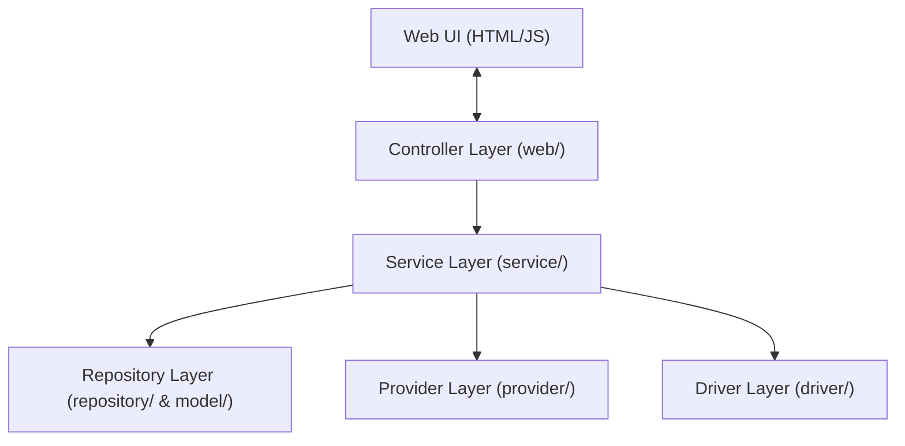

# Supermarket Auto-Buy

Supermarket Auto-Buy is a helper tool that automatically searches and adds items from your shopping list directly to your online supermarket cart. It currently supports **Continente Online**.

Instead of searching for each grocery item one-by-one on the store's website, you can enter your whole list in this app and let it automate the browser interactions for you. 

## Key Features
* 🛒 **Automatic Shopping:** Logs into your supermarket account, searches for each product on your list, and adds it to your cart.
* 🧠 **Smart Product Matching:** If the app is unsure about a product (e.g., you wrote "milk" and there are multiple brands), it displays the matches on the screen and asks you to pick the right one. The app remembers your choice for all future runs!
* 📈 **Price Tracking:** Keeps a history of product prices from each run so you can track price changes over time.
* 💾 **Easy Web Dashboard:** A simple, modern web interface to manage your shopping lists, save your credentials, and start/monitor shopping runs.

---

## Quick Start Guide

### Step 1: Install Java
This app requires **Java (JDK 25 or higher)** to run on your computer.
* **To check if you have it:** Open a terminal (like PowerShell or Command Prompt) and type `java -version`.
* **If you don't have it:** Download and install it from [Adoptium (Eclipse Temurin)](https://adoptium.net/) or your preferred Java vendor.

### Step 2: Run the App
1. Download or clone this project folder to your computer.
2. Open PowerShell or Command Prompt in the project folder.
3. Run the following command:
   ```powershell
   .\mvnw.cmd spring-boot:run
   ```
4. Wait for the terminal to print that the application is running, then open your web browser and go to:
   **[http://localhost:8080](http://localhost:8080)**

### Step 3: Set Up and Shop
Once the web dashboard opens in your browser:
1. **Supermarket Credentials:** Go to the configuration section to enter your supermarket username and password. These are stored locally and securely on your own computer.
2. **Manage Your List:** Write or edit your shopping list directly on the screen.
3. **Start Shopping:** Click the run button. The app will open a browser session in the background. If it finds any items that need your approval, it will present cards for you to select the correct product. Once finished, the app automatically navigates to the cart page in the browser window for your final review!

---

# 🛑 Developer & Technical Documentation

> [!NOTE]
> The sections below contain technical details, architecture diagrams, build/test commands, and developer instructions for modifying the codebase.

## Advanced Configuration & Secrets
For automated execution or advanced users, credentials and database settings can be configured using a `secrets.properties` file in the root directory.

### 1. Local Secrets File
Copy `secrets-example.properties` to `secrets.properties` and fill in:
```properties
continente.username=your-email@example.com
continente.password=your-password
```

### 2. Database Backup & OneDrive Sync
By default, the database is persisted locally in `./data/db.mv.db`. On shutdown, a zipped backup is written to `./data/backups/backup_[timestamp].zip`.
To sync backups to OneDrive, configure the backup directory in your settings:
```properties
autobuy.backup-dir=C:/Users/your-username/OneDrive/SupermarketBackup
```
> [!IMPORTANT]
> **Windows Path Formatting:** Always use forward slashes (`/`) or double backslashes (`\\`) in `.properties` files (e.g. `C:/Users/...`). Single backslashes (`\`) are parsed as escape characters and will corrupt the path.

---

## Application Architecture

The application is built using a **Layered Architecture** style with strict dependency rules:



1. **Controller Layer (`web/`):** Handles REST API requests across domain controllers (`AutoBuyController`, `ConfigController`, `CredentialsController`, `ProductMappingController`, `ShoppingListController`, `SystemController`), translates between HTTP and typed DTO records (`web/dto/`), and delegates all business logic to services. Exceptions are processed globally by `GlobalExceptionHandler`.
2. **Service Layer (`service/`):** Core business logic and transactional boundaries (`ProductService`, `PriceHistoryService`, `AutoBuyWebService`). Methods modifying persistent state are decorated with `@Transactional`.
3. **Repository Layer (`repository/` & `model/`):** Spring Data JPA for H2 database access. Entity relations (such as `PriceHistory.product`) are configured with `FetchType.LAZY` for performance.
4. **Provider Layer (`provider/`):** Interfaces for external data sources (credentials, shopping lists, settings). Implementations are swappable (e.g., `CredentialProvider` → `PropertiesCredentialProvider`, `SettingsProvider` → `PropertiesSettingsProvider`).
5. **Driver Layer (`driver/`):** The `SupermarketDriver` interface and store-specific Playwright implementations for browser automation.

> [!NOTE]
> Each layer may only depend on layers below it. See [AGENTS.md](AGENTS.md) for the full dependency matrix and per-package `package-info.java` files for detailed constraints.

---

## Design Principles

### Minimize Interruptions
The auto-buy run is designed around a **front-load decisions, back-load automation** principle:

| Phase | What Happens | User Involvement |
|---|---|---|
| **Pre-run** | Unmapped items are sorted to the front of the queue. | User resolves all mapping prompts in rapid succession. |
| **Main run** | Mapped items are processed automatically. | None — fully automated. |
| **Post-run** | Exceptions (e.g. unavailable products) are batched for review. | User reviews and resolves at the end. |

### Product Unavailability Handling
If a product is out of stock (either its mapped SKU is not found in the store search or is flagged as out of stock) or if the automation fails to add it to the cart, the system logs a `WARN` message and records the item as skipped. Skipped items are displayed in a dedicated "Skipped Items (Unavailable)" section at the end of the run on the web dashboard.

---

## Database Migrations (Flyway)
The local H2 database schema is versioned and managed incrementally using **Flyway**:
* **Migration Scripts:** Located in [src/main/resources/db/migration/](src/main/resources/db/migration/).
* **Automatic Baselining:** On startup, Flyway checks the database state. If the database is not empty, it applies a baseline (Version 0) to avoid re-running legacy creation scripts and prevent conflicts.
* **Incremental Migrations:** Any new migration scripts are automatically applied in sequence during application startup.
* **JPA Validation:** Hibernate's DDL auto-generation is set to `validate` to ensure that entities strictly match the Flyway-managed schema.

---

## Running Tests
Run the JUnit unit tests using:
```powershell
.\mvnw.cmd test -q
```
*(or `./mvnw test -q` on Linux/macOS)*

To run both unit and integration tests, verify formatting, and enforce code coverage checks (note that you must commit your changes locally first so that the `diff-coverage` plugin can detect the diff against `origin/main`):
```powershell
.\mvnw.cmd verify -q
```
*(or `./mvnw verify -q` on Linux/macOS)*

* **Code Coverage Gate:** The project uses JaCoCo to enforce a **minimum instruction coverage of 80%** on all core logic. Exclusions are defined consistently for both local builds and SonarCloud for non-business boilerplate code (bootstrap, config beans, custom exceptions, entities, records, and the Playwright driver).

---

## GitHub CI Pipeline
The project includes a unified GitHub Actions workflow to verify code quality, security, and test correctness:
- **Workflow Configuration:** [.github/workflows/ci.yml](.github/workflows/ci.yml)
- **Included Checks:**
  - **Secrets Leak Prevention:** TruffleHog scanner checks commit histories.
  - **Dependency & Code Security:** Snyk Open Source & Code scans.
  - **Format Check:** Spotless verification.
  - **Automated Testing:** Unit and Integration tests (JaCoCo 80% coverage check).
  - **Static Code Analysis:** Sends metrics to SonarCloud.

### Required Secrets
To run security scans and SonarCloud analysis in CI, configure the following secrets in your GitHub repository:
- `SNYK_TOKEN`: Snyk API token.
- `SONAR_TOKEN`: SonarCloud authentication token.

---

## AI Agent Context
* Refer to [AGENTS.md](AGENTS.md) for architecture rules, layer dependencies, coding standards, and testing conventions.
* Each Java package contains a `package-info.java` with package-specific constraints.

