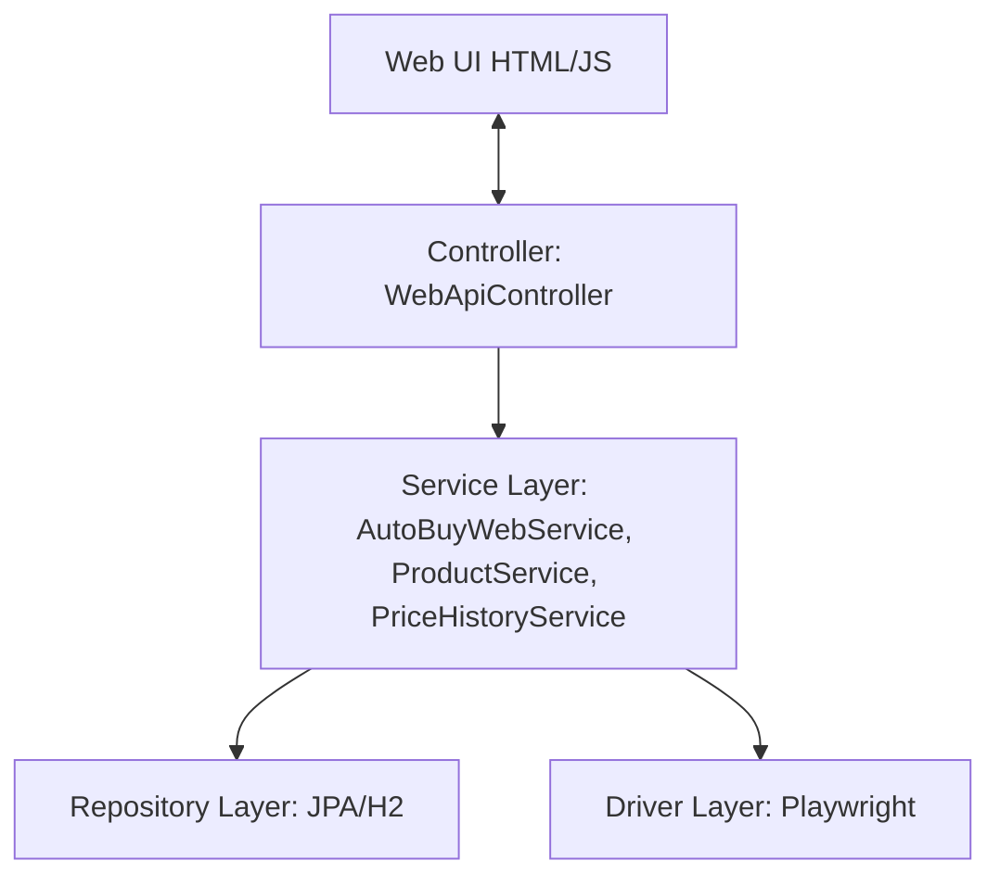

# Supermarket Auto-Buy

Supermarket Auto-Buy is a modular, AI-first Spring Boot web application powered by **Microsoft Playwright**. It automates online grocery shopping (starting with **Continente Online**) by reading a structured shopping list, logging into the store, searching for items, mapping search queries to exact product SKUs, logging price history in a local H2 database, and adding the items to the shopping cart.

---

## Features

1. **Robust Playwright Automation:** Automates logging in, accepting cookies, performing product queries, and managing cart additions on Continente Online.
2. **Interactive Match Mapping:** If a shopping list item doesn't have an exact SKU mapped in the database, the Web UI queries the store, presents the top matches, and lets you choose the correct product. Your choice is saved for subsequent runs.
3. **Price Tracking & H2 Storage:** Keeps historical records of all item prices from each run in a local, file-persisted H2 database (`data/db.mv.db`).
4. **OneDrive-Safe Snapshot Backups:** Automatically dumps a compressed ZIP/SQL backup of the database to a configured folder (e.g. your OneDrive folder) on application shutdown to avoid live file-locking issues.
5. **AI-First & SOLID Compliance:** Modular architecture using clean interfaces (`SupermarketDriver`, `CredentialProvider`, `SettingsProvider`, `ShoppingListProvider`) and type-safety. Exposes instructions for AI development in `AGENTS.md` and a backlog roadmap in `ROADMAP.md`.

---

## Getting Started

### Prerequisites
* **Java:** JDK 25 or higher.
* **Internet Connection:** Playwright will automatically download browser binaries (Chromium) on the first run.

### 1. Setup Credentials
Copy the template `secrets-example.properties` to `secrets.properties` in the root directory of the project (this file is excluded from Git to keep your credentials private) and fill in your actual credentials:

```properties
continente.username=your-email@example.com
continente.password=your-password
```

*Note: If these properties are empty or the file is missing, the application will prompt you in the Web UI.*

### 2. Create your Shopping List
You can manage and update your shopping list directly via the **Web UI dashboard**. Saving the list in the Web UI will automatically create and update the local `shopping-list.json` file in your root folder.

Alternatively, you can manually create a `shopping-list.json` file (which is gitignored) with this format:
```json
[
  {
    "query": "Mimosa Leite Meio Gordo 1L",
    "quantity": 6
  },
  {
    "query": "Banana Importada kg",
    "quantity": 1
  }
]
```

### 3. Run the Application

Launch the application to start the local web server:
```powershell
# Start the Web application
.\mvnw.cmd spring-boot:run
```
Then, open your browser and navigate to:
**`http://localhost:8080`**

From this premium single-page dashboard, you can:
* Manage items in your shopping list directly with instant saving.
* Configure and save credentials securely without manual properties file edits.
* View and delete product mappings from the local database.
* Execute active shopping runs, monitor progress via logs, select product matches interactively via modal cards, and close the session when done.

---

## Database Snapshot Backup
By default, the database is persisted locally in `./data/db.mv.db`. On shutdown, a zipped backup is written to `./data/backups/backup_[timestamp].zip`.

To sync your backups automatically to **OneDrive**, configure the backup directory in your `application.properties` (or add it directly in `secrets.properties` to keep paths private). 

> [!IMPORTANT]
> **Windows Path Formatting:** Always use forward slashes (`/`) or double backslashes (`\\`) in `.properties` files (e.g. `C:/Users/...`). Single backslashes (`\`) are parsed as escape characters and will corrupt the path.

```properties
autobuy.backup-dir=C:/Users/your-username/OneDrive/SupermarketBackup
```

---

## Application Architecture

The application is built using a **Layered Architecture** style, ensuring clear separation of concerns, easy testing, and SOLID compliance:



1. **Controller Layer (`web/`):** Handles REST API requests, translates input parameters into DTOs (`web/dto/`), and delegates orchestration to services. Caught exceptions are processed globally by `GlobalExceptionHandler`.
2. **Service Layer (`service/`):** Manages core business logic and transactional boundaries. Methods modifying persistent state are decorated with `@Transactional` (e.g., in `ProductService` and `PriceHistoryService`).
3. **Repository Layer (`repository/` & `model/`):** Utilizes Spring Data JPA for H2 database access. Entity relations (such as `PriceHistory.product`) are configured with `FetchType.LAZY` for performance.
4. **Driver Layer (`driver/`):** Contains the automated scraper implementations (e.g., Playwright driving browser sessions on supermarket websites).

---

## Database Migrations (Flyway)

The local H2 database schema is versioned and managed incrementally using **Flyway**:

* **Migration Scripts:** Located in [src/main/resources/db/migration/](file:///C:/Users/marce/.gemini/antigravity/worktrees/supermarket-autobuy/review-application-architecture-standards/src/main/resources/db/migration/).
* **Automatic Baselining:** On startup, Flyway checks the database state. If the database is not empty, it applies a baseline (Version 0) to avoid re-running legacy creation scripts and prevent conflicts.
* **Incremental Migrations:** Any new migration scripts (e.g., `V1__baseline_schema.sql`, etc.) are automatically applied in sequence during application startup (`.\mvnw.cmd spring-boot:run`).
* **JPA Validation:** Hibernate's DDL auto-generation is set to `validate` to ensure that entities strictly match the Flyway-managed schema without making automatic modifications.

---

## Running Tests
Run the JUnit unit and integration tests using:

```powershell
.\mvnw.cmd test
```

*   **Code Coverage Gate:** The project uses JaCoCo to enforce a **minimum instruction coverage of 80%** on all core logic (excluding drivers, CLI, and web package). If your edits cause the coverage to fall below 80%, the Maven test phase will fail.

---

## GitHub CI Pipeline

The project includes a unified GitHub Actions workflow to verify code quality, security, and test correctness on both pull requests and merges to the `main` branch.

- **Workflow Configuration:** [.github/workflows/ci.yml](file:///.github/workflows/ci.yml)
- **Included Checks:**
  - **Secrets Leak Prevention:** TruffleHog scanner checks commit histories.
  - **Dependency & Code Security:** Snyk Open Source & Code scans.
  - **Format Check:** Spotless verification.
  - **Automated Testing:** Unit and Integration tests.
  - **Code Coverage Gate:** Verifies JaCoCo's 80% minimum instruction coverage.
  - **Static Code Analysis:** Sends metrics to SonarCloud and verifies the Quality Gate.

### Required Secrets
To run security scans and SonarCloud analysis in CI, configure the following secrets in your GitHub repository:
- `SNYK_TOKEN`: Snyk API token.
- `SONAR_TOKEN`: SonarCloud authentication token.

---

## AI Agent & Roadmap Contexts
*   Refer to [AGENTS.md](file:///C:/Users/marce/.gemini/antigravity/worktrees/supermarket-autobuy/review-application-architecture-standards/AGENTS.md) for code styling guidelines, SOLID rules, and compiler requirements.
*   Refer to [ROADMAP.md](file:///C:/Users/marce/.gemini/antigravity/worktrees/supermarket-autobuy/review-application-architecture-standards/ROADMAP.md) for the backlog of future integrations (e.g. Google Keep/Tasks, Bitwarden, email invoice parsing, etc.).
